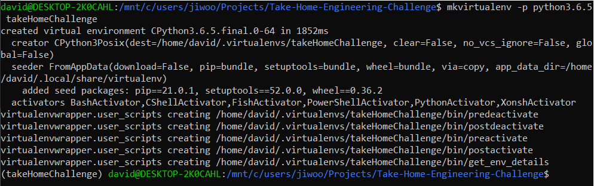
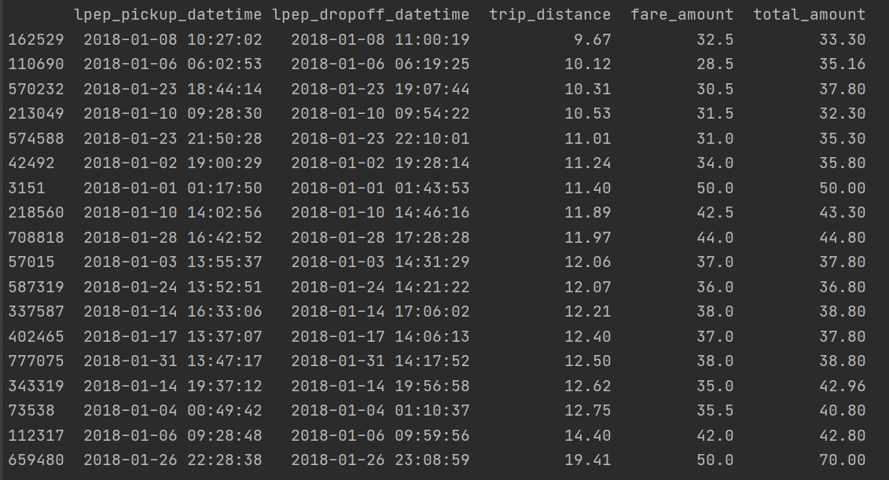

# CLI for NYC trip data

  This repo for NYC trip data analysis are written in `python` `3.6` and can be run from the current directory


Unzip NYC transport data in root path and Set up Python virtual environment: 


### unzip data file root path such as (/tripdata/*.csv)

 ```python
https://cseboulderinterview.blob.core.windows.net/triprecord/tripdata.zip
```

### Set up virtual environment

 ```python
mkvirtualenv -p python3.6.5 takeHomeChallenge
```




##### Firstly, just select one of the following options as the first parameter. 
```python
yellow_cap
green_cap
forhire_vehicle
```
##### and set pick up location and drop off location with start_zone and end_zone parameters respectively

```python
start_zone=
end_zone=
```
##### and if you want to sort trip distance with ascending order, append trip_distance parameter with True

```python
trip_distance=
```
##### if you want to sort total amount of fare, append total_amount paratmeter with True.
```python
total_amount=
```
##### Finally, CLI command would be the followings:
 
 ```python
python main.py yellow_cap start_zone=Astoria end_zone=Bayside trip_distance=True
```



 ```python
python main.py yellow_cap start_zone=Astoria end_zone=Bayside total_amount=True
```


